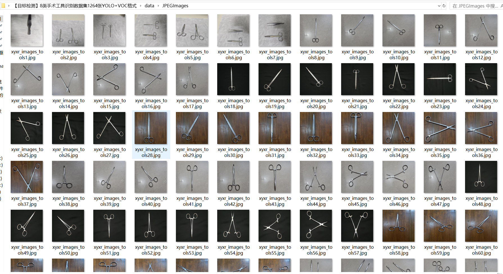
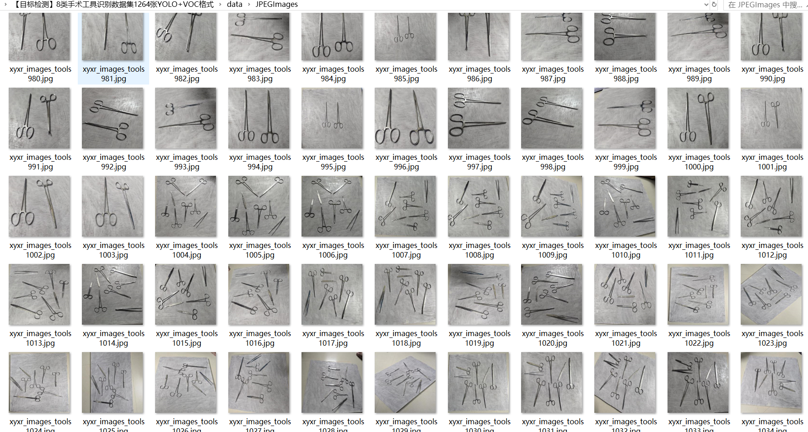

# [Object Detection] 8-classHand Spell Tool Recognition Dataset 1264 imagesYOLO+VOC format

Dataset Format: VOC format + YOLO format

The compressed file contains: three folders, each storing images, xml files, and text files.

The total number of jpg images in the JPEGImages folder is 1264.

Total number of XML files in the Annotations folder: 1264

The total number of txt files in the labels folder is 1264.

Number of tag types: 8

Label Names: ["Allis Tissue Forceps", "Curved Artery Forceps", "Curved Mayo Scissor", "Needle Holder", "Scalpel", "Straight Artery Forceps", "Straight Dissection Clamp", "Straight Mayo Scissor"]

The number of boxes for each label (Note that the order of labels in the Yolo format does not correspond to this, but is based on the classes.txt file in the labels folder):

Allis Tissue Forceps Frames = 481 (Tissue Forceps)

Curved artery forceps = 486 (Curved artery forceps)

Curved Mayo Scissor Frame Number = 482 (Arctic Mayo Scissor)

Needle Holder frame number = 489 (Needle holder)

Scalpel Frame Count = 488

Straight Artery Forceps Frames = 487 (Straight Artery Forceps)

Straight Dissection Clamp frame count = 486 (straight dissection clamp)

Straight Mayo Scissor frame count = 481

Total Frames: 3880

Picture clarity (Resolution: Pixels): Clear

Is the image enhanced: No

Shape of the label: Rectangular box, used for object detection and recognition.

Important Note: None

Special Notice: This dataset does not guarantee the accuracy or precision of the trained models or weight files. The dataset only provides accurate and reasonable annotations.

## Images

---

Here is a pay link on Stripe (https://buy.stripe.com/3cs8yP7sY87d0vu9AB). Please contact me lonlonago@foxmail.com after funding $89, and I will send you a complete data files, thank you!

